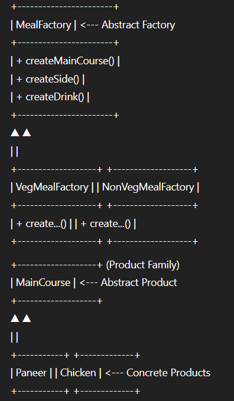

# Abstract Factory Design Pattern

## Definition

The **Abstract Factory** pattern is a creational design pattern that provides an interface for creating families of related or dependent objects without specifying their concrete classes.  
Instead of creating objects directly, client code works with factory interfaces, which return objects belonging to a particular family (or set) that are designed to work together.

This pattern is ideal when a system must support multiple “families” of products—such as matching UI themes, platform-specific widgets, or, in this case, coordinated meal combos for a food delivery platform.

---

## Real-World Analogy

Imagine a food delivery app offering different **meal combos**.  
Each combo (e.g., Veg Combo, Non-Veg Combo) always includes a matching set: main course, side, and drink.  
By using a specific combo factory, the app ensures customers always receive a set of dishes that go together.  
If you switch from a Veg Combo Factory to a Non-Veg Combo Factory, you get a new set, but still, every item matches the meal type—no accidental mixing.

---

## UML/Class Structure

---

## Use Cases

- Food combos: meal sets (veg, non-veg, kids, etc.)
- UI themes: creating matching widgets (buttons, menus, dialogs) for each style
- Multi-platform support: families of drivers or UI controls per OS

---

## Benefits

- Ensures consistency among related products (no mix-and-match errors)
- Allows swapping entire families of products with a single change
- Supports Open/Closed Principle (easy to add new families by extending factories)
- Decouples client code from concrete product classes

---

## When to Use

- When your code must work with multiple families of related objects
- When you want to guarantee objects from the same family are always used together

---

## When Not to Use

- When you only need to create single products, not coordinated sets
- When product families rarely change, or only one family exists

---
