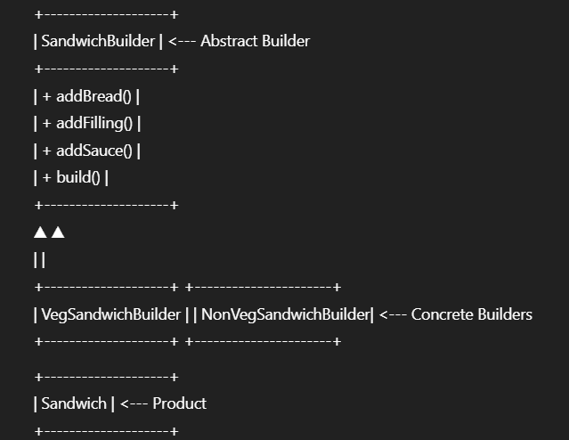

# Builder Design Pattern

## Definition

The **Builder** pattern is a creational design pattern that separates the construction of a complex object from its representation, so that the same construction process can create different representations.  
Rather than using a large constructor with many optional parameters, the Builder pattern lets you create an object step by step, allowing for more readable, flexible, and maintainable code—especially when dealing with objects that have many configuration options.

This pattern is especially useful when an object requires several steps to be constructed or when different configurations or “flavors” of an object are needed, but the construction process remains the same.

---

## Real-World Analogy

Imagine you’re ordering a custom sandwich from a restaurant app:
- You choose your bread, fillings, sauce, and extras in any order you like.
- When done, you “build” the final sandwich.

The **SandwichBuilder** lets you assemble your sandwich in steps, making sure you don’t miss anything and allowing you to create many different types of sandwiches from the same steps.

---

## UML/Class Structure

---

## Use Cases

- Building complex food orders with many options (e.g., sandwiches, pizzas)
- Constructing objects with many optional fields (configuration objects, UI components)
- Creating different representations of a product with the same build steps

---

## Benefits

- Readable, step-by-step object creation (fluent interface)
- Avoids huge constructors and messy parameter lists
- Makes it easy to create different versions of an object
- Supports immutability (can build final object once, no changes after)

---

## When to Use

- When an object requires many steps to be constructed, or has many optional fields
- When you want to construct different representations of a complex object using the same process

---

## When Not to Use

- When the object is simple and doesn’t require many steps/options
- When all configuration can easily be handled with a single constructor

---
