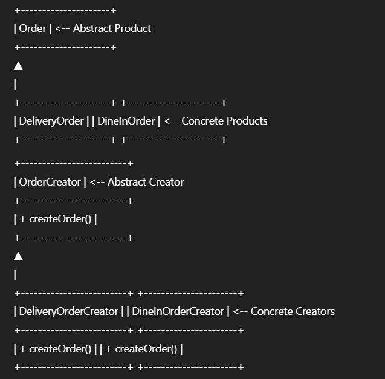

## Definition

The **Factory Method** pattern is a creational design pattern that provides an interface for creating objects in a superclass, but allows subclasses to alter the type of objects that will be created.

Rather than calling constructors directly throughout the codebase, the Factory Method pattern encapsulates object creation within a method—called the "factory method"—defined in an abstract base class or interface. Concrete subclasses implement this method to instantiate specific types of products.

This approach decouples the client code from the concrete classes it needs to instantiate, supporting the Open/Closed Principle: new product types can be introduced with minimal modification to existing code.  
By using Factory Method, developers can write more flexible, maintainable, and easily extensible code that accommodates evolving requirements and supports multiple object families or hierarchies.

---

## Real-World Analogy

In a food delivery platform, new types of **orders** (e.g., regular delivery, scheduled delivery, or dine-in order) may be introduced.  
If object creation is hardcoded throughout the codebase, adding new order types requires widespread changes, leading to brittle, unmaintainable code.

The **Factory Method** centralizes creation logic:  
Each subclass provides its own implementation for creating a specific order type, so new types can be added with minimal changes.Whenever a user places an order, the type of order (Delivery, Dine-In, Scheduled) is selected dynamically.  
Rather than writing “if-else” or “switch” logic everywhere, you encapsulate object creation in creator classes, allowing the system to grow with new order types easily.

---

## UML/Class Structure

---

## Use Cases

- Creating different types of orders based on user selection (Delivery, Dine-In, Scheduled, Takeaway)
- Payment method objects (CreditCard, UPI, Wallet) depending on user choice
- Notification channels (Email, SMS, Push)

---

## Benefits

- Centralizes and encapsulates object creation
- Supports adding new order types with minimal code changes
- Reduces coupling between client code and concrete classes
- Promotes the Open/Closed Principle

---

## When to Use

- When a class cannot anticipate the class of objects it must create
- When subclasses should specify the objects they create
- When you want to localize the knowledge of which helper subclass is the delegate

---

## When Not to Use

- When object creation is simple and unlikely to change
- When performance is critical and extra indirection is not justified

---

