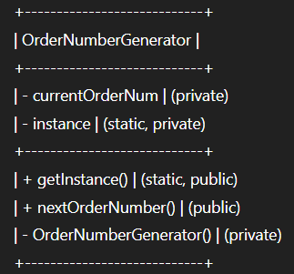

# Singleton Design Pattern

## Definition

The **Singleton** pattern ensures a class has only one instance and provides a global point of access to it.

---

## Real-World Analogy

In a food delivery platform, every new order must receive a unique, sequential order number.  
If multiple instances of an order number generator exist, there is a risk of generating duplicate or out-of-sequence order numbers, which can break tracking, billing, and order management.

**Singleton** guarantees that only one `OrderNumberGenerator` exists, centralizing and synchronizing order number assignment.

---

## UML/Class Structure

- Constructor is private so no external instantiation.
- Static method `getInstance()` gives global access to the unique instance.
- All order number assignment goes through this class.

---

## Use Case in Food Delivery

- **OrderNumberGenerator:**  
  - Provides a single, authoritative way to assign unique order numbers.
  - Ensures no duplicates and sequential integrity, even under high load or with many concurrent requests.

---

## Benefits

- Prevents duplicate or inconsistent order numbers.
- Centralized control for easy audit or reset.
- Lazy initialization: order number generator is created only when needed.

---

## When to Use

- When you must guarantee a single, globally accessible instance.
- When system consistency or resource management depends on single ownership (e.g., ID generators, configuration).

---

## When Not to Use

- When multiple instances are allowed or needed.
- In distributed or multi-process environments where a single instance cannot be enforced without extra infrastructure.

---

