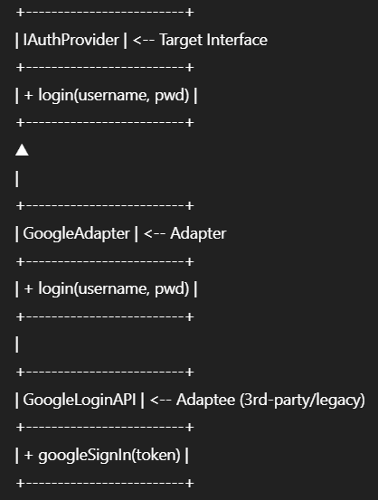

# Adapter Design Pattern

## Definition

The **Adapter** pattern is a structural design pattern that allows objects with incompatible interfaces to collaborate.  
By wrapping an existing class with a new interface, Adapter acts as a translator—enabling code that expects a certain interface to interact with classes that otherwise would not be compatible. It helps systems integrate third-party or legacy components without modifying their source code.

---

## Real-World Analogy

In a social media platform, suppose you want to let users log in with Google, Facebook, or Twitter accounts.  
Each provider has its own, unique API.  
Rather than rewrite your entire authentication code for every provider, you use an **Adapter** for each one—translating their login methods to match your platform’s expected authentication interface.  
Just like a universal power plug adapter allows devices from different countries to connect to any socket, the Adapter pattern lets your code “plug into” different external services seamlessly.

---

## UML/Class Structure

---

## Use Cases

- Integrating third-party login providers (Google, Facebook, Twitter) into a unified login system
- Allowing your app to work with different image or video APIs without changing business logic
- Adapting legacy services or classes to a new codebase

---

## Benefits

- Enables the integration of code with incompatible interfaces
- Promotes code reuse by leveraging existing libraries/services
- Minimizes changes to existing code and reduces risk of bugs
- Decouples system components, making future changes easier

---

## When to Use

- When you need to connect existing code with a new or different interface
- When you want to use third-party or legacy classes that don’t match your code’s expected interfaces
- When you need to support multiple, interchangeable APIs or services

---

## When Not to Use

- When you have control over all source code and can standardize interfaces directly
- When performance is critical and the small overhead of wrapping may be unacceptable
- When adapting is more complex than simply reimplementing a standard interface

---
