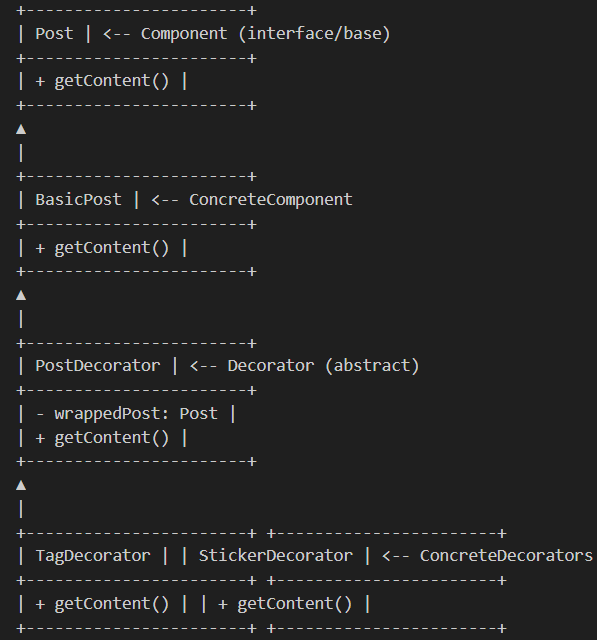

# Decorator Pattern

## Definition

The **Decorator Pattern** is a structural design pattern that lets you attach new behaviors to objects by placing them inside special wrapper objects (decorators). This provides a flexible alternative to subclassing for extending functionality.

---

## Real World Analogy
 
On a social media app, a basic post can be "decorated" with stickers, filters, tags, or reactions, all without modifying the original post. Each extra feature wraps the original post, just as decorators wrap an object to add new functionality.

---

## UML Diagram

---

## Use Cases

- Dynamically add features (e.g., filters, stickers, tags) to social media posts.
- Add logging, security, or validation layers to objects at runtime.
- Decorate GUI elements (e.g., scrollbars, borders, themes).

---

## Benefits

- Add responsibilities to objects dynamically without altering their code.
- Combine multiple behaviors in flexible ways.
- Adheres to Single Responsibility and Open/Closed principles.

---

## When to Use

- When you need to add features to individual objects without affecting the whole class.
- When subclassing leads to too many classes.
- When you want behaviors to be combined at runtime.

---

## When Not to Use

- When all possible extensions are known at compile time (inheritance is simpler).
- When too many layers make debugging difficult.
- When object identity/type must be preserved (decorators can obscure this).

---
